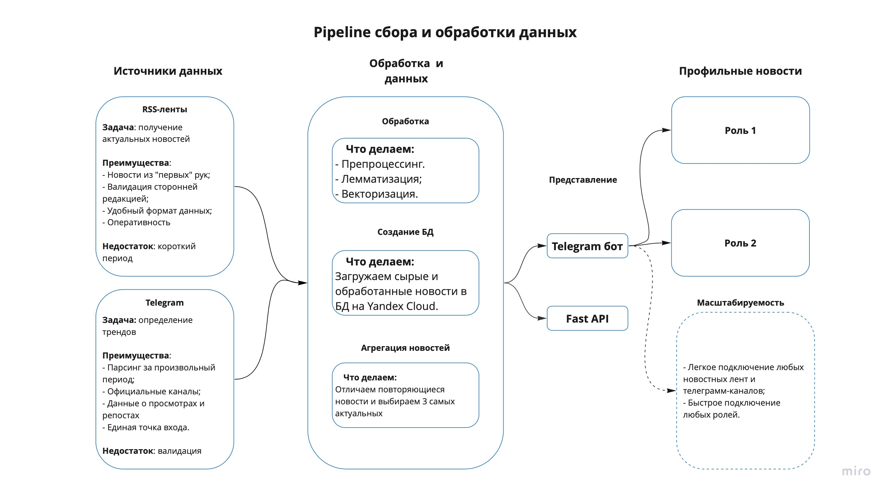

### How-Tos

- **Use**:
    
    `pip install poetry`
    
    `poetry install`
    
- **Links:**
    - DB API: [http://158.160.6.46:8000/docs](http://158.160.6.46:8000/docs)
    - Tg bot: [https://t.me/DB_NewsBot](https://t.me/DB_NewsBot)
    - Drive: [https://disk.yandex.ru/d/uLmfsRbl1qbFug](https://disk.yandex.ru/d/uLmfsRbl1qbFug)

# Постановка задач

- Разработать сервис по автоматическому сбору новостей.
- Реализовать инструменты для анализа собранных данных.
- Ранжировать и рекомендовать новости для заданных групп пользователей (бухгалтер, гендиректор).

# Проблемы и допущения

**Проблема: валидация данных. (Fake News)** 

**Допущение**: При решении задачи мы исходили из того, что процесс сбора данных должен быть разбит на части - точечно собирать данные гораздо удобнее, и на выходе мы получим информацию, которая потребует меньше затрат на проверку и подтверждение. Мы поставили себе ограничение по ресурсам из которых собираем новости.

**Проблема: масштабируемость решения.**

**Допущение**: Мы поставили себе ограничение по тематикам новостей.

# Подход к решению задачи

# Что сделано
- Организован процесс сбора новостей.
- Обработка текстовых данных.
- Формирование итоговой БД в ClickHouse.
- Агрегация и отбор новостей.
- Телеграм бот для просмотра отобранных новостей
- FastApi ручка

**Векторизация данных.**
- С помощью RuBert-Tiny ([https://huggingface.co/cointegrated/rubert-tiny2](https://huggingface.co/cointegrated/rubert-tiny2)) превращаем всю доступную информацию о новости в Embedding
- Записываем полученные Embeddings в https://github.com/meilisearch/meilisearch для дальнейшей работы с ними
- Можем делать Fuzzy Search по новостям

### **ОПИСАНИЕ БД**

**Новости:**

source: Источник новостей
label: Тематика
headline: Заголовок новости
description: Краткое описание новости
link: Ссылка на источник
date: Дата публикации
hash_id: Уникальный id новости

## Источники данных:
**Информационные ресурсы**

- РБК;
- Коммерсант;
- Финам;
- Банки.ру;
- BFM.

**Профессиональные ресурсы**

- Главная книга;
- Главбух;
- Клерк;
- Бух.1С;
- Право.ру.

**Правовые ресурсы**

- КонсультантПлюс;
- Гарант

**Правительство**

- Правительство РФ;
- Минэкономразвития;
- Минпромторг;
- Минтруда;
- ЦБ РФ.